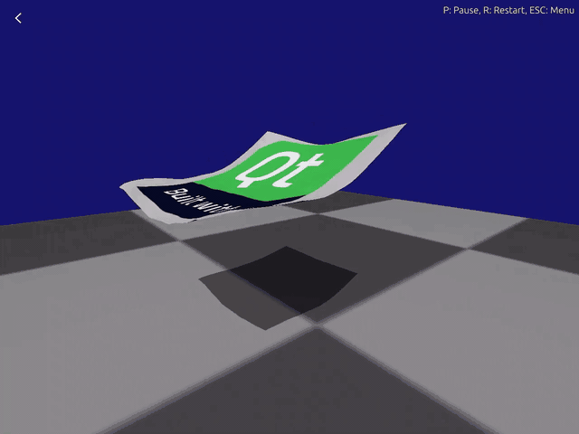

# Qt Quick 3D Jolt Physics

<p align="center">
  
  
  
</p>

**Qt Quick 3D Jolt Physics** is an alternative high-level API for physics simulation in **Qt Quick 3D**, powered by the **[Jolt Physics](https://github.com/jrouwe/JoltPhysics)** engine. It targets desktop and **WebAssembly**, with a declarative QML module `QtQuick3D.JoltPhysics` (and helpers in `QtQuick3D.JoltPhysics.Helpers`).

The API is modeled after [Qt Quick 3D Physics](https://doc.qt.io/qt-6/qtquick3dphysics-index.html) (PhysX), but it is a **separate module** — use `import QtQuick3D.JoltPhysics`, not `import QtQuick3D.Physics`.

## Preview

<p align="center">
  
</p>

## ✨ Features

- ⚡ **High performance** — multi-threaded simulation via Jolt's job system (on platforms that support it).
- 🌐 **WebAssembly** — Jolt and this module can be built for Qt's `wasm_singlethread` / `wasm_multithread` kits.
- 📦 **Shapes** (QML types): `BoxShape`, `SphereShape`, `CapsuleShape`, `CylinderShape`, `PlaneShape`, `ConvexHullShape`, `MeshShape`, `HeightFieldShape`, `EmptyShape`, `RotatedTranslatedShape`, `StaticCompoundShape`.
- ⛓️ **Constraints**: `PointConstraint`, `DistanceConstraint`, `HingeConstraint`, `SliderConstraint`, `FixedConstraint`, `ConeConstraint`, `GearConstraint`, `PathConstraint`, `PulleyConstraint`, `RackAndPinionConstraint`, `SwingTwistConstraint`.
- 🚶 **Characters** — `Character`, `CharacterVirtual`, and related listeners.
- 👕 **Soft bodies** — `SoftBody`, `SoftBodyMeshGeometry`, `SoftBodySharedSettings`, and related types.
- 🎨 **Declarative QML** — `PhysicsSystem`, `Body`, layers/filters, contact listeners, and more.

## 🚀 Getting Started

### Prerequisites

- **Qt 6.9.3** — the module version in [`.cmake.conf`](.cmake.conf) must match your Qt installation (`find_package(Qt6 6.9.3 …)`).
- **Qt BuildInternals** — included in the Qt SDK / source build used for developing Qt modules (not a minimal runtime-only Qt).
- Modules: **Core**, **Gui**, **Qml**, **Quick**, **Quick3D** (pulled in automatically when building the repo).
- **CMake 3.16+**
- C++ compiler with **C++17** support
- For WebAssembly: **Emscripten** via [emsdk](https://emscripten.org/), plus a matching Qt **wasm** kit (e.g. `wasm_singlethread`).

---

### 🖥️ Building & installing (desktop)

```bash
git clone git@github.com:glazunov999/qtquick3djoltphysics.git
cd qtquick3djoltphysics

cmake -B build -DCMAKE_PREFIX_PATH=/path/to/Qt/6.9.3/gcc_64
cmake --build build --parallel
cmake --install build
```

With `-DCMAKE_PREFIX_PATH` pointing at your Qt prefix, **`CMAKE_INSTALL_PREFIX` defaults to that same path**, so `cmake --install` installs the QML plugin and libraries into your Qt tree. After that:

- QML: `import QtQuick3D.JoltPhysics`
- CMake: `find_package(Qt6 COMPONENTS Quick3DJoltPhysics)`

> Qt recommends the **Ninja** generator for building Qt modules; `Unix Makefiles` works but may trigger a CMake warning.

#### Examples (optional)

Examples are **off** by default (`QT_BUILD_EXAMPLES=OFF`). Enable them when configuring:

```bash
cmake -B build -DCMAKE_PREFIX_PATH=/path/to/Qt/6.9.3/gcc_64 -DQT_BUILD_EXAMPLES=ON
cmake --build build --parallel
```

The default build includes the **gallery** example:

```bash
./build/examples/quick3djoltphysics/gallery/example_gallery
```

---

### 🌐 Building & installing (WebAssembly)

Use the same configure/build/install flow, but point CMake at your **wasm** Qt kit and the Emscripten toolchain:

```bash
cmake -B build-wasm \
  -DCMAKE_TOOLCHAIN_FILE=/path/to/emsdk/upstream/emscripten/cmake/Modules/Platform/Emscripten.cmake \
  -DCMAKE_PREFIX_PATH=/path/to/Qt/6.9.3/wasm_singlethread

cmake --build build-wasm --parallel
cmake --install build-wasm
```

Consumer apps must also be built against the same wasm Qt kit with this module installed into that prefix.

---

## 🎮 Examples in the repository

| Directory | In default CMake build | Description |
|-----------|------------------------|-------------|
| `gallery` | yes | Large set of shape/constraint/soft-body/character tests |
| `simple` | no* | Basic rigid bodies on a plane |
| `customshapes` | no* | Custom geometry as colliders |
| `joints` | no* | Prismatic, revolute, and rope joints |
| `cannon` | no* | Shooting / impulse demo |
| `charactercontroller` | no* | Walkable character in a scene |
| `compoundshapes` | no* | Linked compound colliders |
| `impeller` | no* | Rotating impeller and sensor zones |

\*These have local `CMakeLists.txt` files; build them from their directory after the module is installed, e.g.:

```bash
cmake -S examples/quick3djoltphysics/joints -B joints-build \
  -DCMAKE_PREFIX_PATH=/path/to/Qt/6.9.3/gcc_64
cmake --build joints-build
./joints-build/example_joints
```

---

## 🛡️ License

**Qt Quick 3D Jolt Physics** is licensed under the **[MIT License](LICENSE)**.

### Third-party components

This repository bundles the **[Jolt Physics Library](https://github.com/jrouwe/JoltPhysics)**, which is also licensed under the **MIT License** (Copyright © Jorrit Rouwe).
